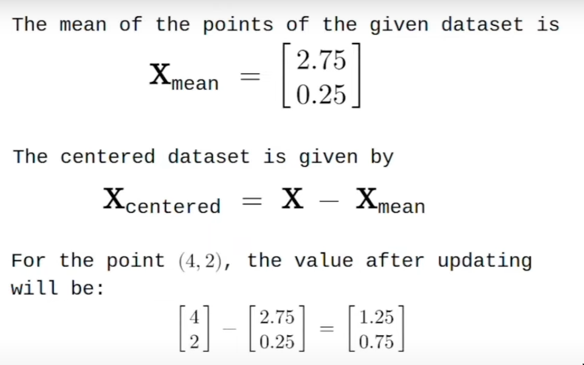
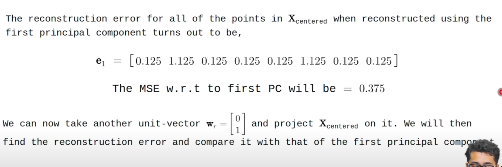

# Steps involvd PCA

1. Center the dataset
2. Calculate its Covariance matrix
3. Compute eigenvectors and eigenvalues
4. sort eigenvalues in descending order and choose top k eigenvectors
5. Transform the original data by multiplying it with the selected eigenvectors(PC's) to get lower dimnensional representation

### Observe the dataset:
Let's take a dataset X of shape (d, n) where
* d is the no of features
* n is the no of data points


### 1. Center the dataset



### 2. Calculate the covariance matrix


### 3. Compute eigenvectors and eigenvalues
we use python class Solver to calculate the eigenvectors and eigenvalues of covariance matrix C
```python
(lamda, w) = Solver(C)
```


1. How many pricipal components do we need to explain 95% of variance in the dataset?

so k = 1 is enough for our dataset

2. Represent the data using two principal component and find reconstruction error for each of the component


the above is the scalar projection of the points

the below is th vector projection of the points


Adding two projections we get


as the points are in R<sup>2</sup> we can get back to the original dataset when we use both the principal components




